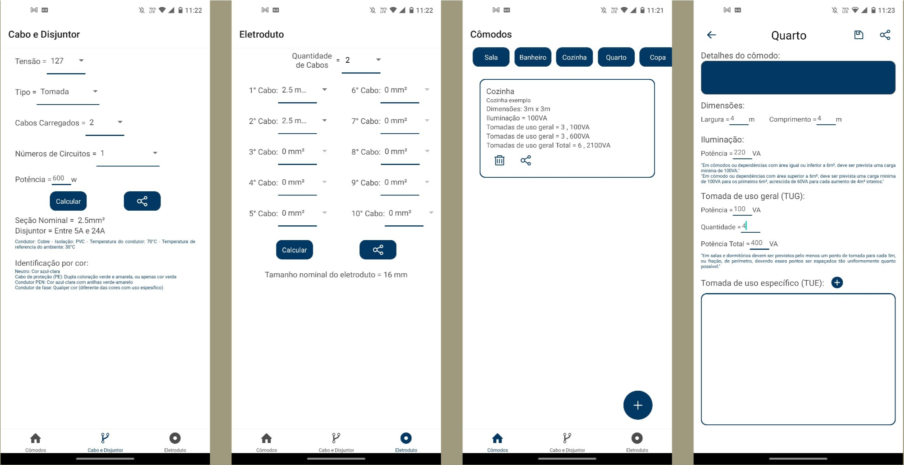

# Instalações Elétricas

## Sobre
Esse app foi criado como meu TCC em engenharia elétrica, e tem como função auxiliar na criação e no controle de projetos elétricos residenciais, calculando a potência de iluminação, as tomadas necessárias para o comodo, a seção do cabo, o disjuntor para proteção e a seção nominal do eletroduto, seguindo as normas da ABNT a NBR-5410

___

## Tecnologias 💻

-   [React Native](https://reactnative.dev/)
-   [Expo](https://expo.io)

___

### Baixe o App

[Instalações Elétricas](https://play.google.com/store/apps/details?id=com.app.InstalacaoEletricas&hl=pt-BR)
